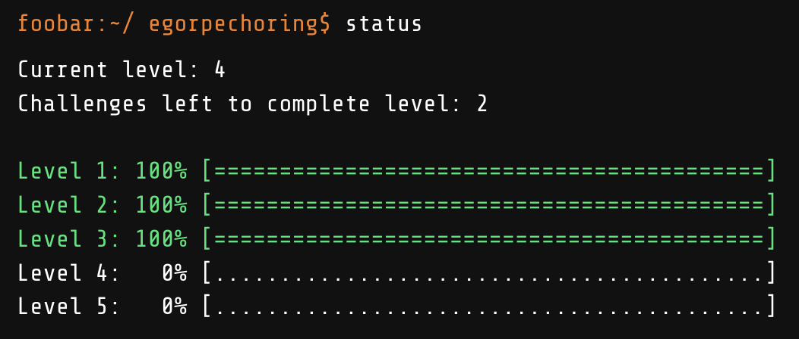

# Google FooBar challenge

During my participation in the FooBar challenge, I completed several tasks, which I would like to share as a representation of my abilities. 
Level 4 and 5 is bonus levels.

Although this list is not exhaustive, it provides a comprehensive overview of the challenges I encountered and resolved:

- Level 1 [Solar Doomsday](#solar-doomsday)
- Level 3 [Task N](#task-n)
- Level 3 [Task M](#task-m)
- Level 3 [Fuel Injection Perfection](#fuel-injection-perfection)

## Solar Doomsday

Who would've guessed? Doomsday devices take a LOT of power. Commander Lambda wants to supplement the LAMBCHOP's quantum antimatter reactor core with solar arrays, and you've been tasked with setting up the solar panels. 

Due to the nature of the space station's outer paneling, all of its solar panels must be squares. Fortunately, you have one very large and flat area of solar material, a pair of industrial-strength scissors, and enough MegaCorp Solar Tape(TM) to piece together any excess panel material into more squares. For example, if you had a total area of 12 square yards of solar material, you would be able to make one 3x3 square panel (with a total area of 9). That would leave 3 square yards, so you can turn those into three 1x1 square solar panels.

Write a function solution(area) that takes as its input a single unit of measure representing the total area of solar panels you have (between 1 and 1000000 inclusive) and returns a list of the areas of the largest squares you could make out of those panels, starting with the largest squares first. So, following the example above, solution(12) would return [9, 1, 1, 1].

-- Java cases --

Input:
Solution.solution(12)

Output:
    9,1,1,1

Input:
Solution.solution(15324)

Output:
    15129,169,25,1

## Task N

You're awfully close to destroying the LAMBCHOP doomsday device and freeing Commander Lambda's bunny workers, but once they're free of the work duties the bunnies are going to need to escape Lambda's space station via the escape pods as quickly as possible. Unfortunately, the halls of the space station are a maze of corridors and dead ends that will be a deathtrap for the escaping bunnies. Fortunately, Commander Lambda has put you in charge of a remodeling project that will give you the opportunity to make things a little easier for the bunnies. Unfortunately (again), you can't just remove all obstacles between the bunnies and the escape pods - at most you can remove one wall per escape pod path, both to maintain structural integrity of the station and to avoid arousing Commander Lambda's suspicions. 

You have maps of parts of the space station, each starting at a work area exit and ending at the door to an escape pod. The map is represented as a matrix of 0s and 1s, where 0s are passable space and 1s are impassable walls. The door out of the station is at the top left (0,0) and the door into an escape pod is at the bottom right (w-1,h-1). 

Write a function solution(map) that generates the length of the shortest path from the station door to the escape pod, where you are allowed to remove one wall as part of your remodeling plans. The path length is the total number of nodes you pass through, counting both the entrance and exit nodes. The starting and ending positions are always passable (0). The map will always be solvable, though you may or may not need to remove a wall. The height and width of the map can be from 2 to 20. Moves can only be made in cardinal directions; no diagonal moves are allowed.

-- Java cases --

Input:
Solution.solution({{0, 1, 1, 0}, {0, 0, 0, 1}, {1, 1, 0, 0}, {1, 1, 1, 0}})

Output:
    7

Input:
Solution.solution({{0, 0, 0, 0, 0, 0}, {1, 1, 1, 1, 1, 0}, {0, 0, 0, 0, 0, 0}, {0, 1, 1, 1, 1, 1}, {0, 1, 1, 1, 1, 1}, {0, 0, 0, 0, 0, 0}})

Output:
    11

## Task M

In order to destroy Commander Lambda's LAMBCHOP doomsday device, you'll need access to it. But the only door leading to the LAMBCHOP chamber is secured with a unique lock system whose number of passcodes changes daily. Commander Lambda gets a report every day that includes the locks' access codes, but only the Commander knows how to figure out which of several lists contains the access codes. You need to find a way to determine which list contains the access codes once you're ready to go in. 

Fortunately, now that you're Commander Lambda's personal assistant, Lambda has confided to you that all the access codes are "lucky triples" in order to make it easier to find them in the lists. A "lucky triple" is a tuple (x, y, z) where x divides y and y divides z, such as (1, 2, 4). With that information, you can figure out which list contains the number of access codes that matches the number of locks on the door when you're ready to go in (for example, if there's 5 passcodes, you'd need to find a list with 5 "lucky triple" access codes).

Write a function solution(l) that takes a list of positive integers l and counts the number of "lucky triples" of (li, lj, lk) where the list indices meet the requirement i < j < k.  The length of l is between 2 and 2000 inclusive.  The elements of l are between 1 and 999999 inclusive.  The solution fits within a signed 32-bit integer. Some of the lists are purposely generated without any access codes to throw off spies, so if no triples are found, return 0. 

For example, [1, 2, 3, 4, 5, 6] has the triples: [1, 2, 4], [1, 2, 6], [1, 3, 6], making the solution 3 total.

## Fuel Injection Perfection

Commander Lambda has asked for your help to refine the automatic quantum antimatter fuel injection system for the LAMBCHOP doomsday device. It's a great chance for you to get a closer look at the LAMBCHOP -- and maybe sneak in a bit of sabotage while you're at it -- so you took the job gladly. 

Quantum antimatter fuel comes in small pellets, which is convenient since the many moving parts of the LAMBCHOP each need to be fed fuel one pellet at a time. However, minions dump pellets in bulk into the fuel intake. You need to figure out the most efficient way to sort and shift the pellets down to a single pellet at a time. 

The fuel control mechanisms have three operations: 

1) Add one fuel pellet
2) Remove one fuel pellet
3) Divide the entire group of fuel pellets by 2 (due to the destructive energy released when a quantum antimatter pellet is cut in half, the safety controls will only allow this to happen if there is an even number of pellets)

Write a function called solution(n) which takes a positive integer as a string and returns the minimum number of operations needed to transform the number of pellets to 1. The fuel intake control panel can only display a number up to 309 digits long, so there won't ever be more pellets than you can express in that many digits.

For example:
solution(4) returns 2: 4 -> 2 -> 1
solution(15) returns 5: 15 -> 16 -> 8 -> 4 -> 2 -> 1
Quantum antimatter fuel comes in small pellets, which is convenient since the many moving parts of the LAMBCHOP each need to be fed fuel one pellet at a time. However, minions dump pellets in bulk into the fuel intake. You need to figure out the most efficient way to sort and shift the pellets down to a single pellet at a time. 

The fuel control mechanisms have three operations: 

1) Add one fuel pellet
2) Remove one fuel pellet
3) Divide the entire group of fuel pellets by 2 (due to the destructive energy released when a quantum antimatter pellet is cut in half, the safety controls will only allow this to happen if there is an even number of pellets)

Write a function called solution(n) which takes a positive integer as a string and returns the minimum number of operations needed to transform the number of pellets to 1. The fuel intake control panel can only display a number up to 309 digits long, so there won't ever be more pellets than you can express in that many digits.

For example:
solution(4) returns 2: 4 -> 2 -> 1
solution(15) returns 5: 15 -> 16 -> 8 -> 4 -> 2 -> 1